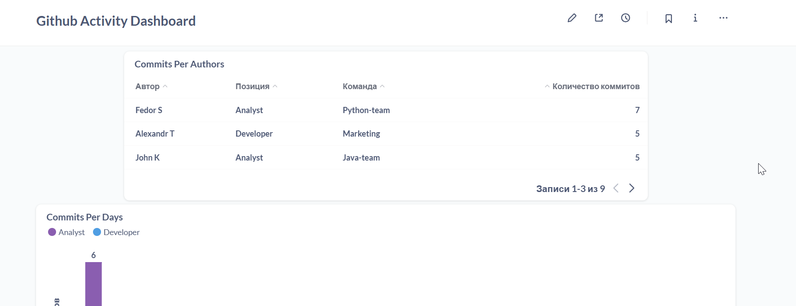
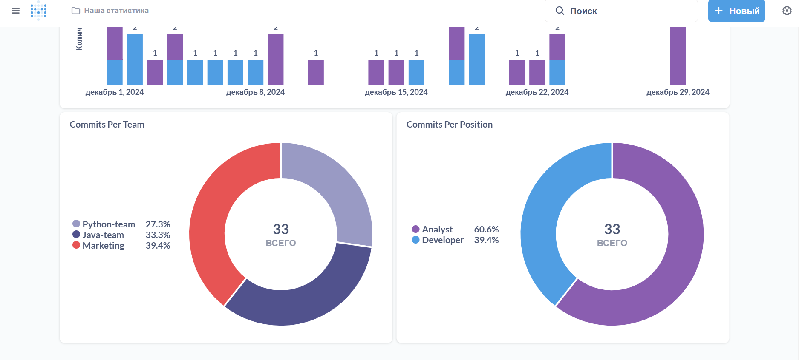

# Проект

Real-time аналитика по репозиторию в github с дополнительным источником данных в виде БД с информацией о пользователях репозитория

### Цель
На примере учебного проекта ознакомиться с современными пайплайнами real-time аналитики


### Задачи проекта

* Необходимо осуществлять сбор и анализ данных о коммитах из выбранного репозитория GitHub (можно эмулировать с помощью генератора)
* Обеспечить возможность использования дополнительного источника данных, содержащего информацию о пользователях (делающих коммиты), например их возраст/команду/позицию с целью смотреть на аналитику в различных срезах
* Реализовать возможность отображать аналитику в режиме реалиного времени через веб-интерфейс.

### Технологии

**Streaming**: Debezium, Kafka
**Infrastructure**: docker-compose
**Databases:** PostgreSQL, ClickHouse
**Language:** Python
**Visualization**: Metabase
**Прочее:** Github API, CDC


# Инструкция

#### 0. Перед началом

Возможно, понадобится добавить `kafka` в `etc/hosts`:

```bash
echo "127.0.0.1       kafka" >> /etc/hosts
```

#### 1. Запустить все компоненты

```bash
docker-compose up -d
```

Стоит проверить, что все контейнеры запустились
```bash
docker ps -q | wc -l  # 7
```

#### 2. Настройка PostgreSQL


```bash
docker exec -it <контейнер postgresql> psql -U postgres -d github-processing-project
```

Настройка БД:

```sql
ALTER SYSTEM SET wal_level = logical;
ALTER SYSTEM SET max_replication_slots = 4;
ALTER SYSTEM SET max_wal_senders = 4;
```

Создаем таблицу, за изменениями которой будем следить:

```sql
CREATE TABLE public.github_users (
    user_name Text,
    position Text,
    team Text
);
```

Создаем публикацию для "слежения" за таблицей:

```sql
CREATE PUBLICATION github_users_publication FOR TABLE public.github_users;
```

#### 3. Настройка Debezium

Чтобы включить CDC, необходимо настроить наш connector. Для этого создаем файл *debezium_configuration.json* с следующей конфигурацией:

```json
{
    "name": "postgres-connector", 
    "config": {
        "connector.class": "io.debezium.connector.postgresql.PostgresConnector",
        
        "database.hostname": "postgres",
        "database.port": "5432", 
        "database.user": "postgres",
        "database.password": "postgres",
        "database.dbname": "github-processing-project", 
        "database.server.name": "postgres", 

        "plugin.name": "pgoutput", 
        "tasks.max": "1",
        "topic.prefix": "postgres", 
        "publication.name": "github_users_publication",
        "table.whitelist": "public.github_users",
        
        "key.converter": "org.apache.kafka.connect.json.JsonConverter",
        "value.converter": "org.apache.kafka.connect.json.JsonConverter",
        "value.converter.schemas.enable": "false",
        "key.converter.schemas.enable": "false",        
        "transforms": "flatten", 
        "transforms.flatten.type": "org.apache.kafka.connect.transforms.Flatten$Value",
        "transforms.flatten.delimiter": "."
    }
}
```

Данный конфиг включает в себя настройку SMT (`"transforms": "flatten"`). Оно позволяет упростить обработку данных на стороне consumer (в данном случае consumer-ом будет clickhouse).

Затем отправляем конфиг в поднятый debezium: 
```bash
curl -i -X POST -H "Accept:application/json" -H  "Content-Type:application/json" http://localhost:8083/connectors/ -d @debezium_configuration.json
```

API для работы с сonnectors:
```bash
curl -X GET http://localhost:8083/connectors/ # посмотреть все коннекторы
curl -X DELETE http://localhost:8083/connectors/{connector_name} # удалить коннектор
```

#### 4. Настройка Clickhouse

```bash
docker exec -it <контейнер clickhouse> clickhouse-client
```
Создаем БД для аналитики

```sql
CREATE DATABASE github;
USE github;
```

Создаем целевые таблицы:

- Таблица для хранения коммитов
```sql
CREATE TABLE commits
(
    `commit_id` String,
    `author` String,
    `commit_message` String,
    `commit_date` Date
)
ENGINE = MergeTree
ORDER BY commit_date
```

- Таблица для хранения информации об авторах коммитов (например, сотрудники организации или члены команды)

```sql
CREATE TABLE users
(
    `user_name` String,
    `position` String,
    `team` String
)
ENGINE = ReplacingMergeTree
ORDER BY user_name
```

Далее настроим **интеграцию Kafka и ClickHouse**. Для этого воспользуемся `KafkaTableEngine`.

Создаем БД для приема данных:
```sql
CREATE DATABASE ingestion;
USE ingestion;
```

Создаем "таблицы":
* для коммитов
```sql
CREATE TABLE commits_queue
(
    `commit_id` String,
    `author` String,
    `commit_message` String,
    `commit_date` String
)
ENGINE = Kafka
SETTINGS kafka_broker_list = 'kafka:9092', kafka_topic_list = 'commits_topic', kafka_group_name = 'commits_group', kafka_format = 'JSONEachRow', kafka_num_consumers = 1
```

* для пользователей
```sql
CREATE TABLE ingestion.users_queue
(
    `before.user_name` Nullable(String),
    `before.position` Nullable(String),
    `before.team` Nullable(String),
    `after.user_name` Nullable(String),
    `after.position` Nullable(String),
    `after.team` Nullable(String),
    `source.version` Nullable(String),
    `source.connector` Nullable(String),
    `source.name` Nullable(String),
    `source.ts_ms` Nullable(UInt64),
    `source.snapshot` Nullable(String),
    `source.db` Nullable(String),
    `source.sequence` Nullable(String),
    `source.schema` Nullable(String),
    `source.table` Nullable(String),
    `source.txId` Nullable(UInt64),
    `source.lsn` Nullable(UInt64),
    `source.xmin` Nullable(UInt64),
    `op` String,
    `ts_ms` Nullable(UInt64),
    `transaction.id` Nullable(UInt64),
    `transaction.total_order` Nullable(UInt64),
    `transaction.data_collection_order` Nullable(UInt64)
)
ENGINE = Kafka
SETTINGS kafka_broker_list = 'kafka:9092', kafka_topic_list = 'postgres.public.github_users', kafka_group_name = 'users_group', kafka_format = 'JSONEachRow', kafka_num_consumers = 1
```

Далее создаем прослойку между приемом данных и целевыми таблицами:

```sql
CREATE MATERIALIZED VIEW commits_mv TO github.commits AS
SELECT
    commit_id,
    author,
    commit_message,
    CAST(commit_date, 'date') AS commit_date
FROM ingestion.commits_queue
```

```sql
CREATE MATERIALIZED VIEW users_mv TO github.users AS
SELECT
    `after.user_name` AS user_name,
    `after.position`  AS position,
    `after.team`      AS team
FROM ingestion.users_queue
```

#### 5. Тестируем

Вставим данные в таблицу `public.github_users`:

```sql
INSERT INTO public.github_users (user_name, position, team) VALUES ('Ivan M', 'Developer', 'Java-team');
INSERT INTO public.github_users (user_name, position, team) VALUES ('John K', 'Analyst', 'Java-team');
INSERT INTO public.github_users (user_name, position, team) VALUES ('Alisa R', 'Developer', 'Java-team');

INSERT INTO public.github_users (user_name, position, team) VALUES ('Roman F', 'Developer', 'Python-team');
INSERT INTO public.github_users (user_name, position, team) VALUES ('Fedor S', 'Analyst', 'Python-team');
INSERT INTO public.github_users (user_name, position, team) VALUES ('Veronika A', 'Developer', 'Python-team');

INSERT INTO public.github_users (user_name, position, team) VALUES ('Anatoly A', 'Analyst', 'Marketing');
INSERT INTO public.github_users (user_name, position, team) VALUES ('Masha R', 'Analyst', 'Marketing');
INSERT INTO public.github_users (user_name, position, team) VALUES ('Alexandr T', 'Developer', 'Marketing');
INSERT INTO public.github_users (user_name, position, team) VALUES ('Vladimir L', 'Analyst', 'Marketing');
```

Можно проверить, загрузились ли данные в Clickhouse:

```sql
SELECT * 
FROM github.users
```

Затем запустим генератор фейковых коммитов:
```bash
python main/producer.py --source fake
```

Можно проверить, загружаются ли данные в Clickhouse:
```sql
SELECT * 
FROM github.commits
```

На этом работа над архитектурой завершена. Далее нужно настроить metabase: подключить БД, создать запросы и построить дашборд (выходит за рамки инструкции) и можно удовольствоваться real-time аналитикой!




